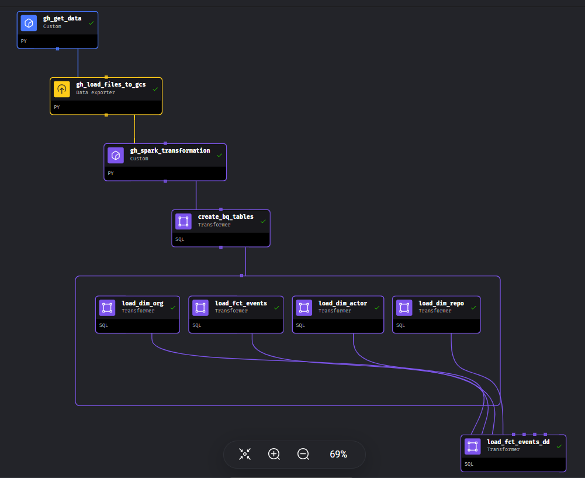

## Project description

The goal of this project is to extract analytical insights from public GitHub events data, focusing on aspects such as event distribution across the timeline and identification of the most popular repositories. The project utilizes a batch data pipeline which fetches data daily from the source - [https://data.gharchive.org/](https://data.gharchive.org/). The dataset available on this platform contains GitHub event data starting from 2015. The project leverages Google Looker to provide analytics through a dedicated dashboard, enabling users to visualize and explore the extracted insights.

## Data Pipeline

### General architecture

General architecture is following:

Technologies:

 - Orchestration and Scheduling: Mage (local deployment on Docker);
 - File Storage: Google Cloud Storage;
 - Data processing: Spark (Google Dataproc Cluster deployment);
 - Data warehousing: Google Big Query;
 - Visualization: Google Looker.

## Data model

Target model consists of following entities:
 - Repo: represents Github repository info;
 - Actor: represents Github user info;
 - Org: represents organization info;
 - Event: represents GitHub events (Push,Fork, Delete etc.) info.

### Raw area

Raw area is allocated in GCS bucket with the following folder structure:  
    _../YYYY/MM/DD_

Each folder contains archived json files with raw data for a given day.

### Stage area

Stage area is allocated in GCS bucket with the following folder structure:  
    _../entity_name/year=YYYY/month=MM/day=DD_

Each folder contains parquet files for a given day. Data is derived from a corresponding raw-files of the same day.
On top of each entity folder a partitioned BigQuery External table is created.

### Data Mart area

Data Mart area data model:  

Tables are created in BQ as Standart tables. 
Dimension tables are not partitioned, but clustered on Id column.
Fact tables are Partitioned by Event Day.

### Pipeline Processing steps

 - gh_get_data: download raw archived json files for a given day;
 - gh_load_files_to_gcs: uploads raw files to GCS Raw Area folder for a given day;
 - gh_spark_transformation: executes Spark job which reads raw files, transform data into 4 dataframes and saves them into the GCS Stage Area in Parqet format. Dataproc cluster is used as a processing engine. The cluster is started and stopped automatically (depending on pipeline parameters) to reduce costs.
 - gh_create_BQ_tables: creates necessarry tables in Bigquery, if they don't yet exist.
 - load_dim_org/ load_dim_actor/ load_fct_events/ load_dim_repo/ load_fct_events_dd - load data into DWH Data Mart entities using SQL, executed on BigQuery.

### Pipeline execution

 - Start Mage instance ( open _mage_ folder and execute _docker-compose up_).
 - Go to [triggers page](http://localhost:6789/pipelines/github_daily_load/triggers/) and start _Github Events Daily Load trigger_.

### Pipeline parameters

| Parameter                 | Value                                       | Description                                                          |
| --------------------------| ------------------------------------------- | -------------------------------------------------------------------- |
| p_cluster_name            | cluster_name                               |  Dataproc cluster name                                                                    |
| p_flag_stop_cluster       | Y                                           | Stop Dataproc cluster after job is done. If N - cluster will not be stopped |
| p_gcs_bucket_name         | GCS bucket name                             |                                                                      |
| p_gcs_raw_path            | data/raw/                                   | Folder in GCS bucket for RAW files                                                 |
| p_gcs_stage_path          | data/stage/                                 | Folder in GCS bucket for STAGE files                                               |
| p_load_date               |                                             | Execution date. Overrides default trigger value. If not set, the data will be loaded for yesterday |
| p_project_id              | your_project_id                        |                                                                      |
| p_pyspark_file            | GCS_bucket_name/path/githunb_transform_raw_stage.py | Path to the PySpark file for DataProc job                           |
| p_region                  | europe-west1                                |                                                                      |

## Visualization

[Looker dashbord](https://lookerstudio.google.com/reporting/64579ac3-71c6-45ff-8525-62e1508ec681)

## Deployment

### Prerequisites
 - Installed Terraform, Docker, Docker-Compose, Gsutil;
 - GCP Project;
 - GCP Service account for Terraform with privileges, which allow to create resources(Storage, BigQuery, DataProc, Compute, IAM). Downloaded credentals json file.
  
### GCP resources deployment
 - Open _terraform_ folder of the project;
 - Adjust variables.tf accordingly;
 - Run Terraform Init,Apply. Followwing resources are created:
    1. GCS bucket;
    2. BigQUery dataset;
    3. DataProc Cluster (1 Driver + 2 Executors of _e2-standard-4_ VM);
    4. Service Account with roles _storage.admin, bigquery.admin, dataproc.admin_. This SA will be userd by Mage to run jobs on those services.

### Mage instance local deployment
 Mage instance is deployed locally (via Docker).
 - Open _mage_ folder of the project. 
 - Adjust dev.env accordingly. E.g. GOOGLE_APPLICATION_CREDENTIALS should point to the JSON file with credentials for Serice account created for Mage (see _GCP resources deployment_ p.4). Rename _dev.env_ -> _.env_
 - Adjust mage/de-zoomcamp-prj/io_config.yaml so that GOOGLE_SERVICE_ACC_KEY_FILEPATH points to the  JSON file with credentials for Serice account created for Mage.
 - Run _docker-compose build_,_docker-compose up_  to start Mage instance. Use [localhost:6789](http://localhost:6789) to access Mage UI.
